# Table of Contents

- [Table of Contents](#table-of-contents)
- [Pico\_DHT11\_WeatherStation](#pico_dht11_weatherstation)
    - [Student Information](#student-information)
  - [Project Overview](#project-overview)
    - [Time Required](#time-required)
  - [Project Objective](#project-objective)
    - [Why I Chose This Project](#why-i-chose-this-project)
    - [What Purpose It Serves](#what-purpose-it-serves)
    - [Insights I Expect To Gain](#insights-i-expect-to-gain)
  - [Materials](#materials)
  - [Computer Setup on Windows OS](#computer-setup-on-windows-os)
    - [Prerequisites](#prerequisites)
    - [Steps](#steps)
  - [Updating Firmware on Raspberry Pi Pico W and Running a Test Code](#updating-firmware-on-raspberry-pi-pico-w-and-running-a-test-code)
    - [Prerequisites](#prerequisites-1)
    - [Firmware Update](#firmware-update)
    - [Testing the Board](#testing-the-board)
  - [Creating a New Project with VS Code and Pymakr](#creating-a-new-project-with-vs-code-and-pymakr)
    - [Prerequisites](#prerequisites-2)
    - [Steps](#steps-1)
  - [Troubleshooting](#troubleshooting)
  - [Project Structure](#project-structure)
    - [Projects File Hierarchy](#projects-file-hierarchy)
  - [Putting everything together](#putting-everything-together)
    - [Wiring](#wiring)
    - [Resistors, Current, and Voltage](#resistors-current-and-voltage)
  - [Platform](#platform)
    - [Comparison with other platforms](#comparison-with-other-platforms)
    - [Cloud vs Local](#cloud-vs-local)
    - [Paid vs Free](#paid-vs-free)
    - [Functionality](#functionality)
    - [Scaling](#scaling)
  - [The Code](#the-code)
    - [Transmitting the Data / Connectivity](#transmitting-the-data--connectivity)
  - [Presenting the data](#presenting-the-data)
    - [Visual Examples of the data: showing the output and response](#visual-examples-of-the-data-showing-the-output-and-response)
  - [Finalizing the Design](#finalizing-the-design)
    - [Reflections and Alternate Approaches](#reflections-and-alternate-approaches)
  - [References](#references)

***

# Pico_DHT11_WeatherStation

Building a temperature and humidity sensor

***

### Student Information

**Name:** `Rashed Qazizada`  
**Student ID:** `rq222ah`  

## Project Overview

This project, titled "Pico_DHT11_WeatherStation", aims to create a weather station capable of monitoring and displaying temperature and humidity data. Leveraging the capabilities of the Raspberry Pi Pico W and the DHT11 sensor, this station's data can be accessed from any browser, making it versatile for usage on both computers and mobile phones.

***

### Time Required

The completion of this project, incorporating all related learning, building, and testing, is estimated to take approximately two weeks.

***

## Project Objective

The goal of this project is two-pronged:

1. **Practical Application**: The station serves as a real-time monitor for temperature and humidity, offering useful data for everyday decisions. Whether it's adjusting home climate control or deciding the best time for gardening, the device's information can guide users to make informed choices.

1. **Learning Opportunity**: On a broader scale, this project is a hands-on exploration into the workings of IoT devices. It provides a unique opportunity to understand the integration and operation of components like the Raspberry Pi Pico W and the DHT11 sensor. Consequently, it serves as a stepping stone into the fascinating field of IoT technology.

### Why I Chose This Project

My decision to undertake this project stems from my longstanding interest in the workings of IoT devices and my desire to dive deeper into this fascinating area of technology. Having searched for an IoT course that resonates with my curiosity, the content of this course appeared promising and well-aligned with my interests. This project, therefore, is not merely about building a weather station but serves as a launchpad into my journey of exploring the IoT world.

### What Purpose It Serves

Beyond its practical application of monitoring weather conditions, this project allows me to get my hands dirty with IoT, an area I've always been eager to explore. By building the Pico_DHT11_WeatherStation, I'm not just creating a device that provides valuable data but also taking a significant step into a broader technological realm.

### Insights I Expect To Gain

I anticipate that this project will offer a deep dive into how IoT devices function. By taking up the challenge of building and programming the weather station myself, I expect to gain firsthand experience and insights into IoT device operation and data handling. But more importantly, I see this as the beginning of an exciting journey into the vast world of IoT, and I'm thrilled to see where it leads.
***

## Materials

The key components for the Pico_DHT11_WeatherStation project were obtained from the "Start Kit – Applied IoT at Linnaeus University (2023)" package, available at [Electrokit](https://www.electrokit.com/produkt/start-kit-applied-iot-at-linnaeus-university-2023/). Here's a breakdown of the key materials used:

| Material | Description | Image | Cost (SEK) | Units |
| --- | --- | --- | --- |--- |
| Raspberry Pi Pico W | A small, versatile microcontroller board developed by the Raspberry Pi Foundation. It's powered by a dual-core Arm Cortex-M0+ processor, with flexible digital interfaces. The Pico W version includes wireless capabilities, making it great for IoT projects. It can be programmed using C/C++ or MicroPython. | [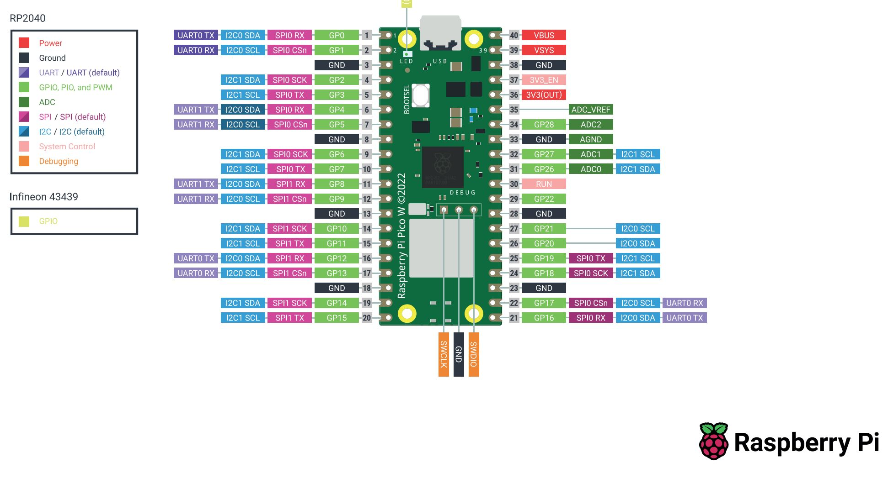](https://www.raspberrypi.com/documentation/microcontrollers/raspberry-pi-pico.html) Fig. 1: The Raspberry Pi Pico W | 109 | 1 |
| USB Cable | USB cable with type-A male connector on one end and mini-B on the other. Common for USB hubs, digital cameras, and other small USB devices. | [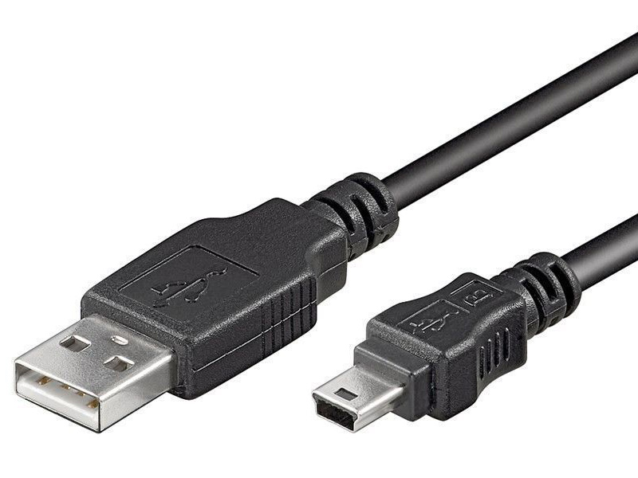](https://www.raspberrypi.com/documentation/microcontrollers/raspberry-pi-pico.html) Fig. 2: The USB Cable | 39 | 1 |
| DHT11 Sensor | A basic, ultra low-cost digital temperature and humidity sensor. It uses a capacitive humidity sensor and a thermistor to measure the surrounding air, and outputs a digital signal. | [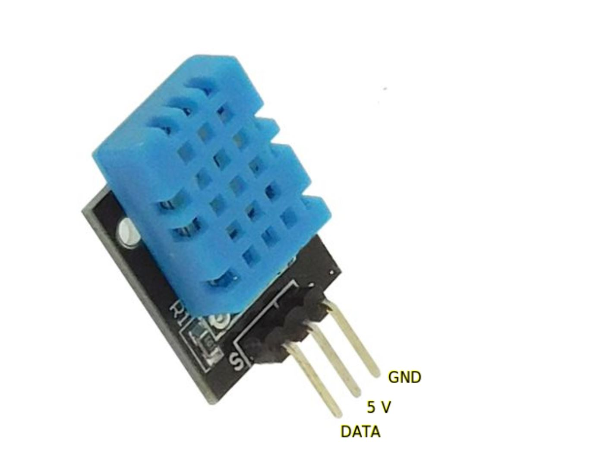](https://www.raspberrypi.com/documentation/microcontrollers/raspberry-pi-pico.html) Fig. 3: The DHT11 Sensor | 49 | 1 |
| Breadboard | Used for prototyping the electronic circuit without the need for soldering. | [](https://www.raspberrypi.com/documentation/microcontrollers/raspberry-pi-pico.html) Fig. 4: The Breadboard | 69 | 1 |
| Wires | Used to connect the components on the breadboard. | [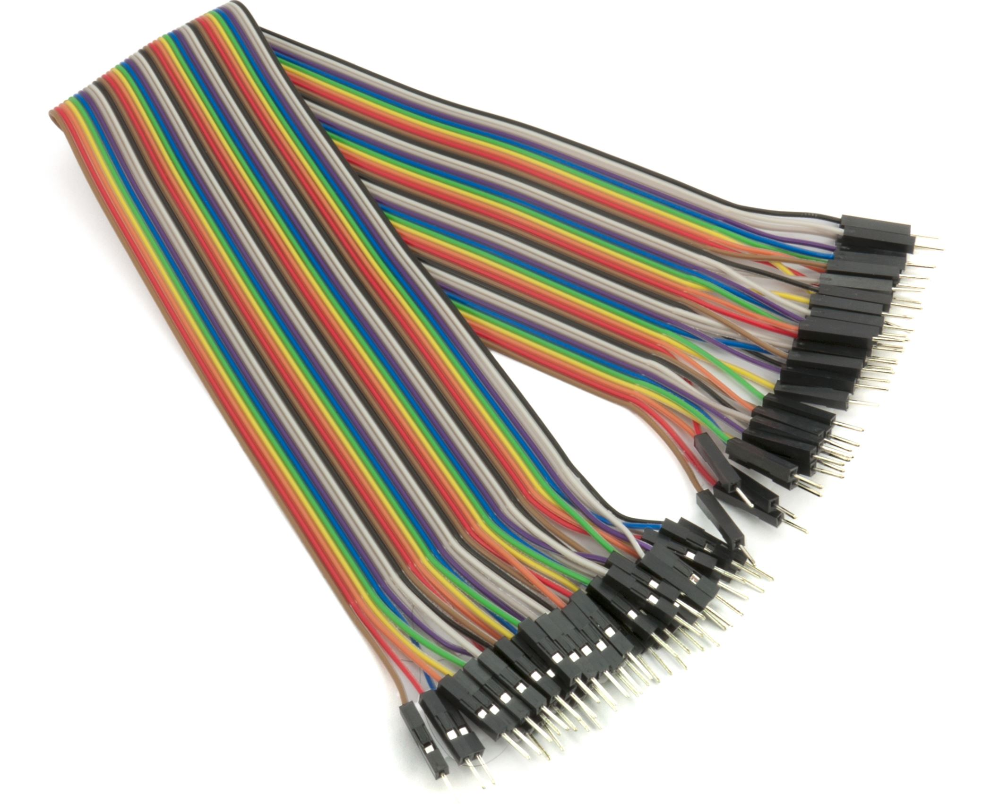](https://www.raspberrypi.com/documentation/microcontrollers/raspberry-pi-pico.html) Fig. 5: The Wires | 49 | 3 |
| **Total** | | | **315** |

***
## Computer Setup on Windows OS

To start working with the Raspberry Pi Pico W and MicroPython, you'll need to setup your computer with the necessary tools. Here's how you do it:

### Prerequisites

- Windows OS
- Internet connection
- Pymakr plugin for your VS Code

### Steps

1. Download and install [Node.js](https://nodejs.org/en/download/)
2. Download and install [VS Code](https://code.visualstudio.com/Download)
3. Install the latest version of [Python](https://www.python.org/downloads/windows/)
4. Open VS Code and then open the Extensions manager. You can do this from the left panel icon, from "View" >> "Extensions", or by pressing `Ctrl+Shift+X`.
5. Search for Pymakr and install it. This plugin helps in connecting and uploading code to your Pico board. You can follow the steps in the below figure to install the plugin:

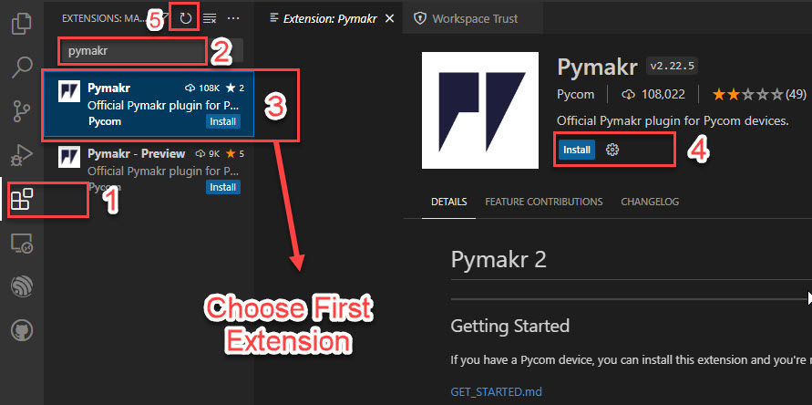

***

## Updating Firmware on Raspberry Pi Pico W and Running a Test Code

### Prerequisites

Before starting with this section, make sure you have:

- Completed the IDE installation tutorial
- A Raspberry Pi Pico board
- A USB Cable (ensure the USB cable has four pins and is capable of data transfer)

### Firmware Update

Follow these steps to update your Raspberry Pi Pico's firmware:

1. Remove the ESD sponge from the Pico before proceeding. (The black sponge attached under your Pico).
2. Download the MicroPython firmware from the official [MicroPython website](https://micropython.org/download/rp2-pico-w/). Be sure to download the latest one from the "Releases" category and not "Nightly Builds".
3. Connect the micro-USB end of your cable (the small side) into the Raspberry Pi Pico. Be sure to firmly hold the back of the USB slot so that by pushing you will not bend it.
4. While holding the `BOOTSEL` button down on the board, connect the USB type A end of your cable (the big side) into your computer’s USB port. You can release the `BOOTSEL` after connecting it to your computer.
5. Your computer should recognize the Pico as a new drive named `RPI-RP2`. Copy the `uf2` file into this storage.
6. Wait until your board automatically disconnects from your computer and reconnects.
7. If you still couldn't figure out how to update the firmware, you can follow the steps in this [video](https://www.youtube.com/watch?v=SL4_oU9t8Ss&list=PLGs0VKk2DiYz8js1SJog21cDhkBqyAhC5).

### Testing the Board

You can test the board to ensure that it's working correctly with MicroPython.

## Creating a New Project with VS Code and Pymakr

Before you can start coding, you need to create a new project with VS Code and Pymakr.

### Prerequisites

1. You've successfully updated the MicroPython firmware on your Raspberry Pi Pico W.
1. VS Code is up and running on your computer.

### Steps

- Open VS Code, go to "File" then click on "New Window".
- Click on the Pymakr extension on the activity bar on the side.
- Then click on "Create Project".
- Create a new folder and select the folder. Let's name it "LNU_Project".
- A pop-up message appears prompting you to confirm your input, press Enter.
- Another pop-up message appears asking you to select "empty" or "led-example". Select "empty" and press Enter.
- The pymakr.conf file opens with the following content:

```json
{
    "name": "Empty Project"
}
```

- Next, click on "Add device" and select your device from the list (Your device should appear here). Click OK.
Note: When you hover over "Empty Project", you'll see a **thunder** sign and a **</>** symbol. The **thunder** sign is used to connect your device and the **</>** symbol starts the debugging mode.

- Click on the **thunder** sign to connect your device.
- Select the **</>** symbol to start debugging mode. This is useful as it restarts the main.py file automatically whenever you make changes to the file and it also saves it to your micro controller as well.
- Now, your device is connected. To open the terminal, go to "Devices" where you'll see your device "USB Serial Device (COM3) / Empty Project". Click on the **>** to open the device terminal.
You are all set! Now, go to your project and start coding in main.py file.

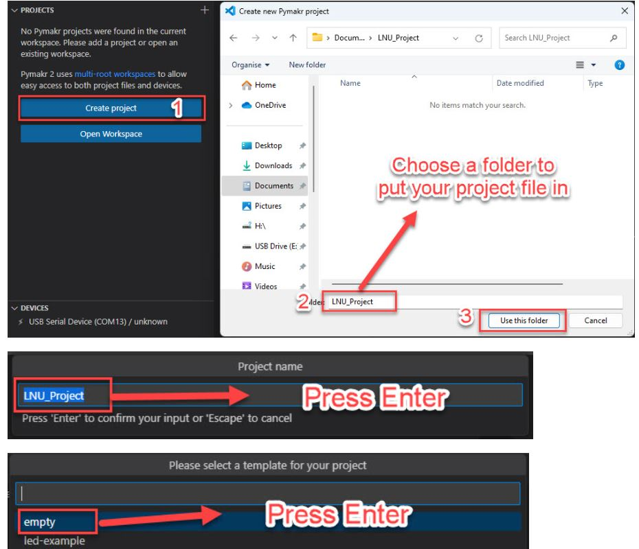

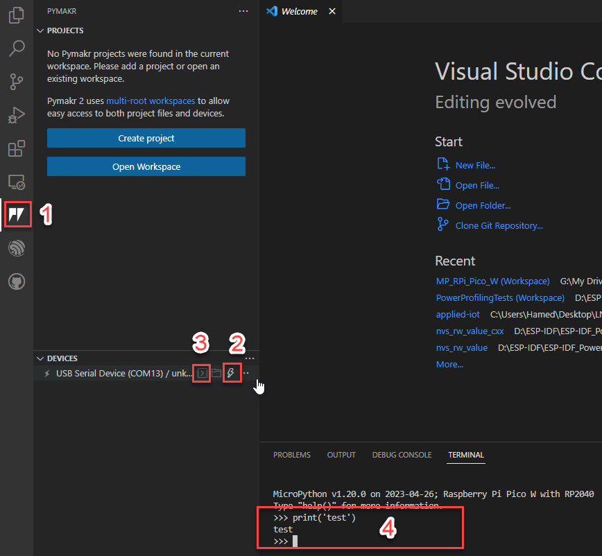


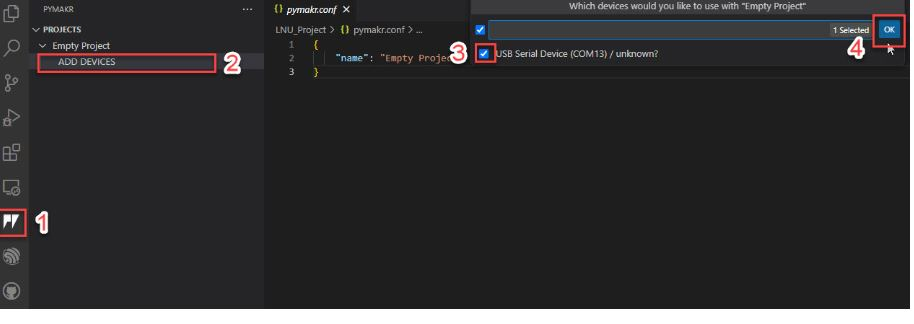

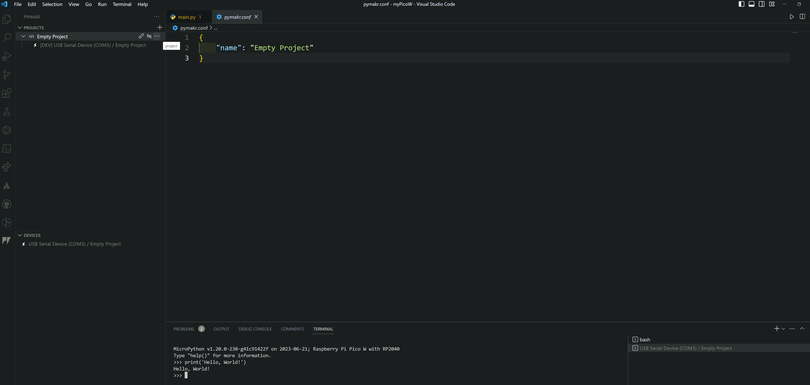

***


1. Input the code snippet shown below after the `>>>` symbols:

```python
print("Hello, world!")
```

1. You should get the same text responded back to you from the connected board like in the picture here:


Congratulations! You've successfully finished this part. It is a good idea to read more about MicroPython tutorials and examples from the [Raspberry Pi Documentation](https://www.raspberrypi.com/documentation/microcontrollers/raspberry-pi-pico.html#content).

## Troubleshooting

If your device gets stuck, follow this part to recover it.

According to the Raspberry Pi team, there is no way to brick this board through software alone. That's because you can always reset it by following the firmware update procedure described above. If you think your board is stuck, follow the procedure for firmware update again, but instead of the usual firmware, use this [special firmware](https://datasheets.raspberrypi.com/soft/flash_nuke.uf2). This will ensure that the memory will be completely erased. Always remember to have a backup of your project before proceeding. You can find a copy of the firmware in this repository in `OtherFiles`.
## Project Structure

This section describes the Pico_DHT11_WeatherStation structure.

### Projects File Hierarchy

``` comments
Pico_DHT11_WeatherStation
|-lib
| |-mqtt.py
|-boot.py
|-main.py
|-secret.py
|-adafruitIO.py
|images
|README.md
|OtherFiles
|.gitignore
|LICENSE
|pymakr.conf
```

***

## Putting everything together

The DHT11 sensor is connected to Pin 27 on the Raspberry Pi Pico W, and the LED is connected to the onboard LED pin (LED_BUILTIN).

### Wiring

- The DHT11 sensor typically has 3 pins: VCC, Data, and Ground. Connect the VCC to 3.3V on the Raspberry Pi Pico W, the Data to GPIO 27, and the Ground to one of the Ground pins on the Raspberry Pi Pico W.
- The LED is already onboard and doesn't need any external connections.

Below are diagrams of the Pi Pico on a breadboard, the wiring setup, and the final assembly

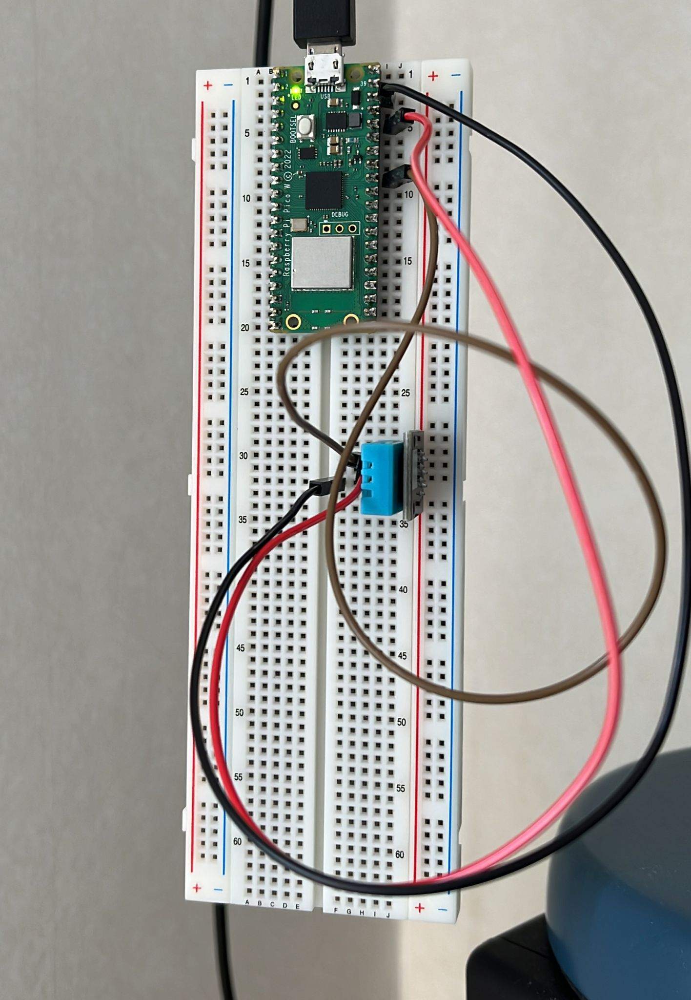

### Resistors, Current, and Voltage

 The DHT11 can operate at 3.3V which is convenient because that's what the Raspberry Pi Pico W can output. Becareful not to connect it to 5V, as that could damage it. In terms of resistors, you don't need any for theDHT11 as it already has a built-in pull-up resistor. However, if you were connecting an external LED, you would typically use a current-limiting resistor.

- **Reliability**: This setup is not robust enough for a production environment. For example, it does not account for instances where the network may be unavailable, or where the sensor may fail.
- **Security**: The WiFi credentials and Adafruit IO key are stored in plaintext in the code. In a production environment, you would want to store these in a secure way.
- **Scalability**: If you wanted to deploy many such devices, you would likely want a more streamlined way to manage them.
- **Fritz Diagram**

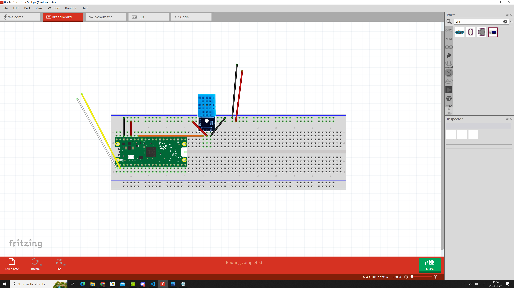

***

## Platform

The platform chosen is the Raspberry Pi Pico, a microcontroller developed by the Raspberry Pi foundation. It's local and it does not require any paid subscription.

### Comparison with other platforms

The Raspberry Pi Pico is an excellent choice for IoT projects due to its simplicity, compact size, and cost-effectiveness. It's powerful enough to handle a variety of tasks yet affordable and accessible, which makes it ideal for prototyping or projects with tight budgets. If compared with other microcontrollers such as Arduino, Pico provides better performance, more flexibility, and runs MicroPython, which is a lean and efficient implementation of the Python 3 programming language.

### Cloud vs Local

This script mainly runs on the local Raspberry Pi Pico device. However, it also communicates with Adafruit IO, a cloud service for IoT, for data exchange. This hybrid approach allows you to collect and process data locally and then publish it to the cloud for remote access, analysis, or interaction.

### Paid vs Free

This implementation uses the free tier of Adafruit IO as an MQTT broker. If you're scaling up your idea, you may need to consider Adafruit IO Plus, the paid version of the service that provides expanded data capacity.

### Functionality

The script collects data from a DHT11 temperature and humidity sensor, generates random numbers, and sends these data to Adafruit IO feeds using the MQTT protocol. It also checks for incoming MQTT messages and controls a connected LED based on these messages.

### Scaling

If you're looking to scale up your idea, you may need to consider a more robust MQTT broker service or host your own, depending on the size of your project. Also, you might need to consider the limitations of the Raspberry Pi Pico, especially for large-scale, complex projects
***

## The Code

The project's file structure is as follows:

- `adafruitIO.py`: This script likely manages the interaction with the Adafruit IO platform, a cloud service designed for storing, sharing, and visualizing data from devices and storing Adafruit IO keys. It is responsible for establishing a connection, publishing data, and subscribing to the Adafruit IO MQTT broker to enable IoT functionalities.

- `boot.py`: A special file in MicroPython that is executed when the device boots up. This script typically handles Wi-Fi connections and other boot-time configurations. It runs before `main.py`.

- `main.py`: This is the script that's run following `boot.py` during device startup. It likely contains the primary logic of the program, checking for MQTT messages and sending random numbers to the Adafruit IO platform.

- `secrets.py`: This file stores sensitive data like Wi-Fi credentials. Keeping these details separate from the main code files enhances security.

- `LICENSE`, `README.md`: These are documentation files. `LICENSE` outlines the permissions others have regarding the code, while `README.md` offers an overview of the project, setup instructions, and usage guide.

- `pymakr.conf`: This file is specific to Pymakr, a plugin compatible with Atom and Visual Studio Code IDEs that facilitates communication with Pycom devices. This file probably contains configuration details for Pymakr.

- `imges`, `lib`, `OtherFiles`: These directories store additional resources used by the program. `imges` contain image assets, `lib` store additional libraries or dependencies required by the main program, and `OtherFiles` hold various other resources or scripts related to the project.

***

### Transmitting the Data / Connectivity

- The data from the `Raspberry Pi Pico W` is transmitted to the internet using `Wi-Fi` and uses the `MQTT protocol` to send data to the `Adafruit IO` server.

- `MQTT` is a lightweight messaging protocol designed for connections where a `small code footprint` is required or network bandwidth is limited. It is commonly used in IoT applications.

- The data is sent as `MQTT messages`, with the feed name as the topic and data value as the payload. This ensures reliable delivery despite high-latency or unreliable networks.

- `Data` is sent at an interval defined by the `RANDOMS_INTERVAL` variable, which in this case is set to `10000` milliseconds (or 10 seconds).

- The wireless protocol in use is `Wi-Fi` and the transport protocol is `MQTT`. 

- The `send_random()` function measures `temperature` and `humidity`, `generates a random number`, and sends these values to different feeds on the `Adafruit IO server`. This function runs in an infinite loop, sending the data at the specified interval.

- In case of an exception, the `MQTT client disconnects` and cleans up, ensuring a smooth termination of the connection.

***

## Presenting the data

The frequency at which data is send to Adafruit IO is controlled by the RANDOMS_INTERVAL constant, set to 10000 milliseconds, or 10 seconds. This means every 10 seconds, the program reads data from the temperature and humidity sensor, generates a random number, and sends this data to Adafruit IO.

### Visual Examples of the data: showing the output and response

- **Temperature, Humidity and LED**

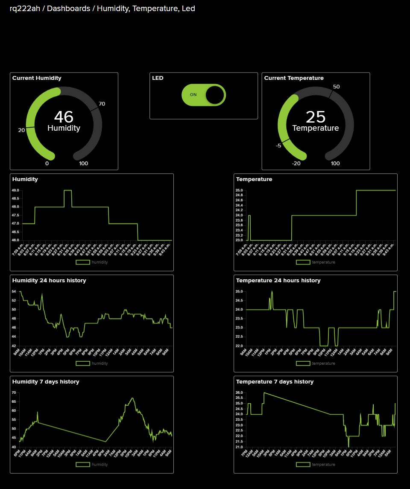

***

## Finalizing the Design

Overall, I am thrilled with how this project turned out. Using the `Raspberry Pi Pico W`, I was able to create a data logger that measures `temperature` and `humidity`, as well as `generating a random number`. These data points were successfully sent over `Wi-Fi using MQTT protocol` to the `Adafruit IO server`.

The Python code developed for the Pico proved to be robust, managing to keep a steady connection and transmitting data at the desired interval.

Considering the smooth completion of the project and the successful data transmission, I believe this was a successful experiment in `IoT` data logging with the `Raspberry Pi Pico W`.

There were undoubtedly challenges along the way, such as setting up the initial configuration and ensuring stable data transmission, but overcoming these obstacles has been a rewarding learning experience.

### Reflections and Alternate Approaches

While I am content with how the project was executed and its outcomes, reflecting on the process offers some valuable insights.

The entire project was developed and tested in an isolated environment due to constraints on physical meetings. If circumstances were different, I would have appreciated the opportunity to have a dedicated day for a physical lab session. Being able to meet and interact with other students, observe their approaches, share ideas, and learn from their implementations would have enriched my learning experience and potentially brought new perspectives to my own project.

Moreover, witnessing real-time troubleshooting and diverse solutions to common problems could have offered a broader understanding of the subject matter and opened avenues for collaborative problem solving. 

Hence, in future similar projects, I would strive to incorporate such interactive sessions to harness the collective wisdom of the group and further enrich the learning experience.

***
## References

- [1DT305 - Introduction to Applied IoT summer 2023](https://lnu-ftk.instructure.com/courses/255)
- [Road map for the course](images/1DT305_Roadmap_Part_3.pdf)
